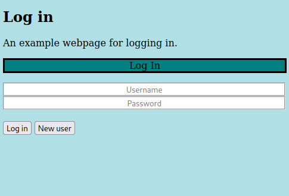

# Log In

This is a simple user log in website written in PHP.

It has the following features...

1. Combines HTML, CSS and PHP.
2. Uses MySQL to store passwords.
3. Stores the password as a hash.
4. Sanitises user information using a regular expression.

Quick start:

Start your apache2 and MySQL services using the following commands...

* service apache2 start
* service mysql start

Create the MySQL database using these commands...

* GRANT ALL ON Projects_Login.* TO 'your_linux_username'@'localhost' IDENTIFIED BY 'my_new_secret_sql_password';
*   CREATE DATABASE Project_LogIn;
*   USE Project_LogIn;
*   CREATE TABLE users (username VARCHAR(128), password VARCHAR(128), status VARCHAR(128)) ENGINE InnoDB;

To access the MySQL database yourself...
* mysql -u your_linux_username -p